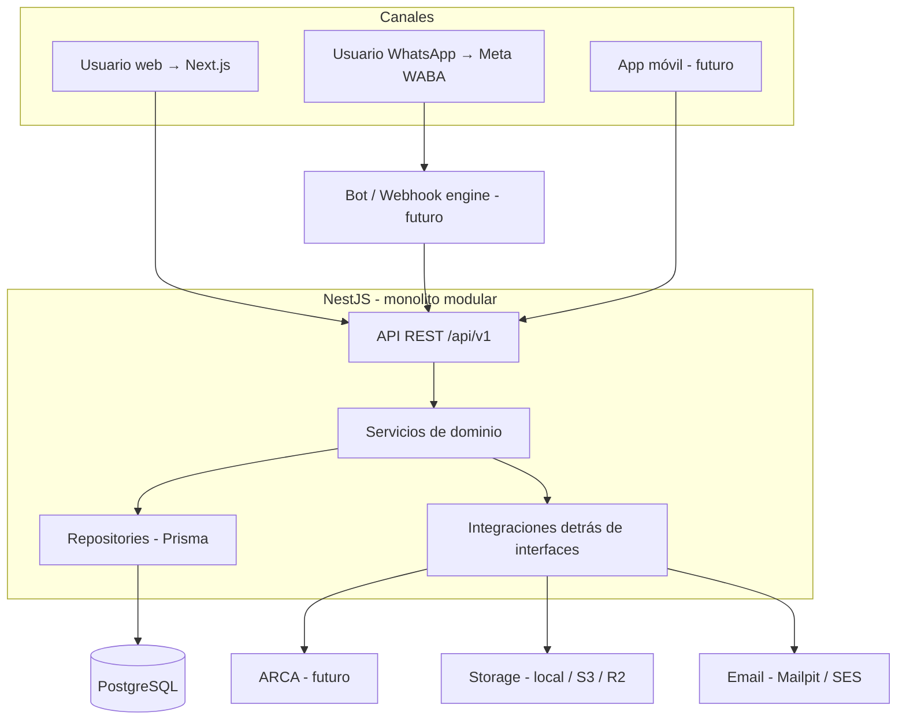
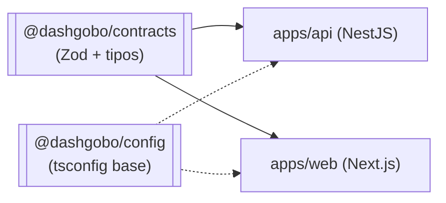
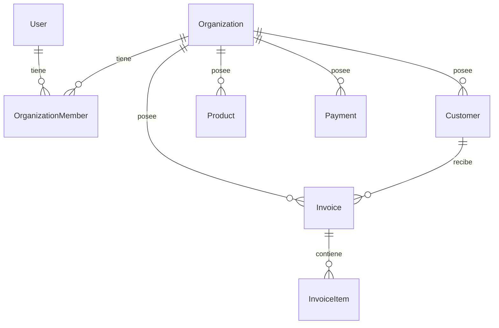
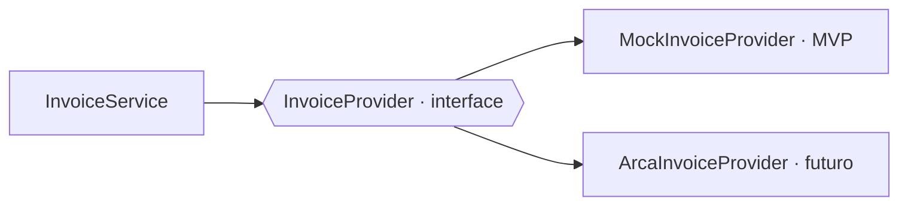
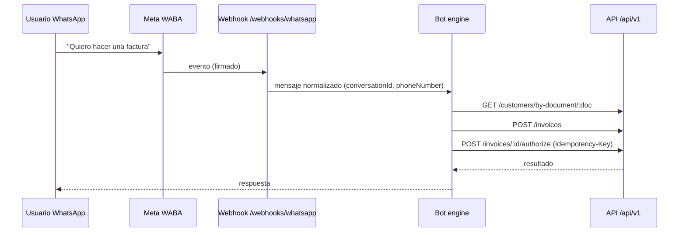

# Arquitectura

## Principio rector

El **backend/API** es la única fuente de verdad y de lógica de negocio. Todos los
canales (web hoy; WhatsApp, móvil, IA después) son clientes de la misma API y
nunca acceden directamente a la base de datos.



## Monorepo



`@dashgobo/contracts` define el **contrato de red** (request/response) con Zod.
No importa Prisma ni nada server-only: las entidades internas del backend no se
exponen tal cual al cliente.

## Backend — capas por módulo

Cada módulo de feature (`auth`, `organizations`, `customers`, `products`,
`invoices`, `payments`, `dashboard`, `settings`, `integrations`, `audit`,
`channels`) se organiza así:

```
modules/<feature>/
├── <feature>.controller.ts   # HTTP: parseo, status codes, nada de lógica
├── <feature>.service.ts      # reglas de negocio, orquestación, transacciones
├── <feature>.repository.ts   # acceso a datos (Prisma), siempre scoping por org
├── dto/                      # DTOs de entrada/salida (derivados de contracts)
├── domain/                   # value objects, errores tipados, state machines
└── <feature>.module.ts
```

Regla de acoplamiento: un módulo usa otro **solo** a través de su `service`
inyectado, nunca tocando su `repository` ni sus tablas. Esto permite extraer un
módulo a un servicio aparte más adelante sin reescrder los consumidores.

## Multi-tenancy



- Toda entidad comercial lleva `organizationId`.
- El `organizationId` **nunca** se toma del body/query sin validar. Se deriva del
  contexto de autenticación (token + membership) mediante un guard.
- Todo query del repositorio filtra por `organizationId`. No hay acceso
  cross-tenant posible por construcción.
- Roles por membership: `OWNER`, `ADMIN`, `ACCOUNTANT`, `OPERATOR`, `VIEWER`
  (RBAC extensible).

## Autenticación (Fase 2)

- Password hashing con Argon2.
- Access token JWT de vida corta + refresh token con **rotación y revocación**
  (tabla de sesiones en DB).
- En la web, el refresh token viaja en cookie `httpOnly` + `SameSite`; el access
  token se mantiene en memoria. Nunca en `localStorage`.
- El bot de WhatsApp usará un flujo de credenciales de servicio distinto (no
  cookies).
- Arquitectura preparada para OAuth como proveedor adicional.

## InvoiceProvider (abstracción ARCA)



Interfaz: `authorizeInvoice()`, `getInvoice()`, `getLastAuthorizedInvoice()`,
`validateCredentials()`. El módulo `invoices` no sabe nada de ARCA: certificados,
clave privada, web services, tokens y CAE viven dentro de `ArcaInvoiceProvider`.
Las credenciales sensibles se cifran en reposo y nunca se exponen al frontend.

## Integración WhatsApp (futura)



Se prepara un módulo `channels` con correlación `conversationId` /
`externalUserId` / `phoneNumber`. El bot consume exclusivamente la API.

## Seguridad (transversal)

Rate limiting, CORS restringido por `CORS_ORIGINS`, headers con `helmet`,
validación estricta de input (Zod/DTO), errores de dominio tipados traducidos a
HTTP, `requestId` por request, logging estructurado con redacción de secretos,
auditoría (`AuditLog`) de operaciones sensibles, idempotencia por
`Idempotency-Key` en endpoints críticos, transacciones de DB para operaciones
multi-entidad.

## Deployment

MVP: contenedores para `api` y `web` + Postgres gestionado. Servicios
**stateless** (el estado vive en Postgres) para permitir escalado horizontal.
Sin Kubernetes, sin colas externas, sin microservicios hasta que la carga real lo
justifique. Observabilidad (Sentry/OTel) se conecta sobre el logging ya
estructurado.
